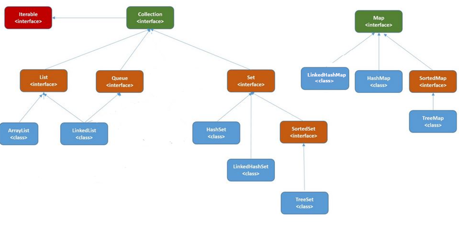
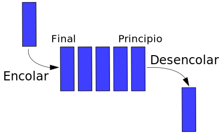

# Preguntas a responder
## Sobre genéricos

1. ¿Cuál es el método genérico que utiliza la interfaz `Comparator`?
2. Si se ha definido una clase Contenedor<T> genérica. ¿Está permitido crear una instancia new Contenedor[5]?
3. Si tuvieras que definir `arrays` con genéricos. ¿Qué letra identifica mejor **T** o **U**?
4. ¿Cuáles son las interfaces genéricas que hemos utilizado para la ordenación en `arrays`?
5. ¿Cúal es el método genérico que utiliza la interfaz `Comparable`?
6. Si hemos definido un array tipo genérico. ¿Se puede realizar la acción new U[10]?
7. ¿Cuál es la diferencia de utilizar la interfaz `Comparable`o `Comparator` con genéricos a utilizarla sin genéricos? 

## Sobre Colecciones

1. ¿Cuáles son las interfaces que vamos a utilizar en las colecciones?¿ por qué se caracteriza cada una de esas interfaces?
2. ¿Cuáles son las clases o los contenedores de las colecciones? por cada clase indica que interfaces implementa.
3. ¿Cuál es la mejora de las estructuras dinámicas con respecto a las estructuras estáticas?
4. ¿Qué interface y qué clase utilizarás si quieres implementar una pila? ¿ que métodos utilizas para desapilar el elemento que corresponde?

5. ¿Qúe interface y qué clase utilizarás si quieres implementar una cola?¿ que métodos utilizas para desencolar el elemento que corresponde?

6. ¿Qué interface y que clase utilizarás si quieres tener una colección de datos cualquiera? Razona tu respuesta
7. ¿Que diferencia existe entre utilizar la clase ArrayList a la clase LinkedList? Razona tu respuesta
